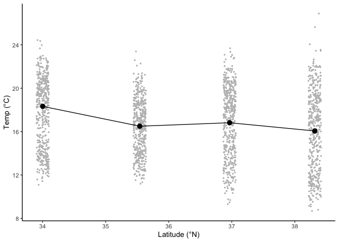

Temp\_Time\_Series
================
Sam Bogan
6/23/2021

This is an R Markdown written by Sam Bogan that reads in, wrangles, summarizes, and analyzes time series temperatures collected from n = 3 per site supralittoral splash pools occupied by *Tigriopus californicus* across 4 sites in coastal California (see README). Data were recorded by TidBit MX5000 temperature loggers made by Onset Computer Corp between 2019 - 2021.

# Identify measurements to filter out

``` r
# Load packages
library( tidyverse )
```

    ## Warning: package 'tidyverse' was built under R version 3.6.2

    ## ── Attaching packages ─────────────────────────────────────── tidyverse 1.3.1 ──

    ## ✓ ggplot2 3.3.5     ✓ purrr   0.3.4
    ## ✓ tibble  3.1.2     ✓ dplyr   1.0.6
    ## ✓ tidyr   1.1.3     ✓ stringr 1.4.0
    ## ✓ readr   1.4.0     ✓ forcats 0.5.1

    ## Warning: package 'ggplot2' was built under R version 3.6.2

    ## Warning: package 'tibble' was built under R version 3.6.2

    ## Warning: package 'tidyr' was built under R version 3.6.2

    ## Warning: package 'readr' was built under R version 3.6.2

    ## Warning: package 'purrr' was built under R version 3.6.2

    ## Warning: package 'dplyr' was built under R version 3.6.2

    ## Warning: package 'forcats' was built under R version 3.6.2

    ## ── Conflicts ────────────────────────────────────────── tidyverse_conflicts() ──
    ## x dplyr::filter() masks stats::filter()
    ## x dplyr::lag()    masks stats::lag()

``` r
library( Rmisc )
```

    ## Loading required package: lattice

    ## Warning: package 'lattice' was built under R version 3.6.2

    ## Loading required package: plyr

    ## ------------------------------------------------------------------------------

    ## You have loaded plyr after dplyr - this is likely to cause problems.
    ## If you need functions from both plyr and dplyr, please load plyr first, then dplyr:
    ## library(plyr); library(dplyr)

    ## ------------------------------------------------------------------------------

    ## 
    ## Attaching package: 'plyr'

    ## The following objects are masked from 'package:dplyr':
    ## 
    ##     arrange, count, desc, failwith, id, mutate, rename, summarise,
    ##     summarize

    ## The following object is masked from 'package:purrr':
    ## 
    ##     compact

``` r
library( lubridate )
```

    ## Warning: package 'lubridate' was built under R version 3.6.2

    ## 
    ## Attaching package: 'lubridate'

    ## The following objects are masked from 'package:base':
    ## 
    ##     date, intersect, setdiff, union

``` r
library( data.table )
```

    ## Warning: package 'data.table' was built under R version 3.6.2

    ## 
    ## Attaching package: 'data.table'

    ## The following objects are masked from 'package:lubridate':
    ## 
    ##     hour, isoweek, mday, minute, month, quarter, second, wday, week,
    ##     yday, year

    ## The following objects are masked from 'package:dplyr':
    ## 
    ##     between, first, last

    ## The following object is masked from 'package:purrr':
    ## 
    ##     transpose

``` r
library( tibbletime )
```

    ## Warning: package 'tibbletime' was built under R version 3.6.2

    ## 
    ## Attaching package: 'tibbletime'

    ## The following object is masked from 'package:stats':
    ## 
    ##     filter

``` r
# Read csv describing periods where loggers broke or were aerially exposed
TidBit_meta_df <- read.csv( "~/Documents/GitHub/HotOnes_Tigriopus/Temp_Time_Series/Input_files/TidBit_Deployment_Check_History.csv" )

# Print metadata sheet
TidBit_meta_df
```

    ##        Date Site Logger                Coordinates Submerged Download
    ## 1   3/17/20  RMR   RMR1 35°32'24.4"N 121°05'32.8"W       Yes      Yes
    ## 2   3/17/20  RMR   RMR2 35°32'21.0"N 121°05'29.3"W       Yes      Yes
    ## 3   3/17/20  RMR   RMR3 35°32'20.9"N 121°05'29.1"W       Yes      Yes
    ## 4   3/18/20   SC    SC1 36°57'55.5"N 122°07'33.5"W       Yes      Yes
    ## 5   3/18/20   SC    SC2 36°57'55.4"N 122°07'33.5"W       Yes      Yes
    ## 6   3/18/20   SC    SC3 36°57'55.4"N 122°07'33.5"W       Yes      Yes
    ## 7   3/19/20  BMR   BMR1 38°18'58.9"N 123°04'18.9"W       Yes      Yes
    ## 8   3/19/20  BMR   BMR2 38°18'59.1"N 123°04'18.9"W       Yes      Yes
    ## 9   3/19/20  BMR   BMR3 38°18'58.9"N 123°04'18.7"W       Yes      Yes
    ## 10  8/24/20  PTD   PTD1 34°00'03.2"N 118°48'18.7"W       Yes      Yes
    ## 11  8/24/20  PTD   PTD2 34°00'07.7"N 118°48'17.9"W       Yes      Yes
    ## 12  8/24/20  PTD   PTD3 34°00'07.7"N 118°48'18.0"W       Yes      Yes
    ## 13  9/19/20  PTD   PTD1 34°00'03.2"N 118°48'18.7"W       Yes      Yes
    ## 14  9/19/20  PTD   PTD2 34°00'07.7"N 118°48'17.9"W       Yes      Yes
    ## 15  9/19/20  PTD   PTD3 34°00'07.7"N 118°48'18.0"W       Yes      Yes
    ## 16 11/16/20  RMR   RMR1 35°32'24.4"N 121°05'32.8"W       Yes      Yes
    ## 17 11/16/20  RMR   RMR2 35°32'21.0"N 121°05'29.3"W       Yes      Yes
    ## 18 11/16/20  RMR   RMR3 35°32'20.9"N 121°05'29.1"W       Yes      Yes
    ## 19  12/2/20  BMR   BMR1 38°18'58.9"N 123°04'18.9"W       Yes       No
    ## 20  12/2/20  BMR   BMR2 38°18'59.1"N 123°04'18.9"W       Yes       No
    ## 21  12/2/20  BMR   BMR3 38°18'58.9"N 123°04'18.7"W       Yes       No
    ## 22  2/20/21  RMR   RMR1 35°32'24.4"N 121°05'32.8"W        No      Yes
    ## 23  2/20/21  RMR   RMR2 35°32'21.0"N 121°05'29.3"W       Yes      Yes
    ## 24  2/20/21  RMR   RMR3 35°32'20.9"N 121°05'29.1"W       Yes      Yes
    ## 25   4/1/21  BMR   BMR1 38°18'58.9"N 123°04'18.9"W       Yes      Yes
    ## 26   4/1/21  BMR   BMR2 38°18'59.1"N 123°04'18.9"W        No      Yes
    ## 27   4/1/21  BMR   BMR3 38°18'58.9"N 123°04'18.7"W       Yes      Yes
    ## 28   4/2/21  BMR   BMR1 38°18'58.9"N 123°04'18.9"W       Yes       No
    ## 29   4/2/21  BMR   BMR2 38°18'59.1"N 123°04'18.9"W       Yes       No
    ## 30   4/2/21  BMR   BMR3 38°18'58.9"N 123°04'18.7"W       Yes       No
    ## 31   4/5/21   SC    SC1 36°57'55.5"N 122°07'33.5"W       Yes       No
    ## 32   4/5/21   SC    SC2 36°57'55.4"N 122°07'33.5"W       Yes       No
    ## 33   4/5/21   SC    SC3 36°57'55.4"N 122°07'33.5"W       Yes       No
    ## 34  6/13/21  PTD   PTD1 34°00'03.2"N 118°48'18.7"W       Yes       No
    ## 35  6/13/21  PTD   PTD2 34°00'07.7"N 118°48'17.9"W       Yes      Yes
    ## 36  6/13/21  PTD   PTD3 34°00'07.7"N 118°48'18.0"W       Yes      Yes
    ## 37  6/14/21  RMR   RMR1 35°32'24.4"N 121°05'32.8"W       Yes      Yes
    ## 38  6/14/21  RMR   RMR2 35°32'21.0"N 121°05'29.3"W       Yes      Yes
    ## 39  6/14/21  RMR   RMR3 35°32'20.9"N 121°05'29.1"W       Yes      Yes
    ## 40  6/15/21  BMR   BMR1 38°18'58.9"N 123°04'18.9"W       Yes      Yes
    ## 41  6/15/21  BMR   BMR2 38°18'59.1"N 123°04'18.9"W        No      Yes
    ## 42  6/15/21  BMR   BMR3 38°18'58.9"N 123°04'18.7"W       Yes      Yes
    ## 43  6/16/21   SC    SC1 36°57'55.5"N 122°07'33.5"W       Yes      Yes
    ## 44  6/16/21   SC    SC2 36°57'55.4"N 122°07'33.5"W       Yes      Yes
    ## 45  6/16/21   SC    SC3 36°57'55.4"N 122°07'33.5"W       Yes       No
    ##    Tigriopus_californicus Filter_Post_Date
    ## 1                     Yes               No
    ## 2                     Yes               No
    ## 3                     Yes               No
    ## 4                     Yes               No
    ## 5                     Yes               No
    ## 6                     Yes               No
    ## 7                     Yes               No
    ## 8                     Yes               No
    ## 9                     Yes               No
    ## 10                    Yes               No
    ## 11                    Yes               No
    ## 12                    Yes               No
    ## 13                    Yes               No
    ## 14                    Yes               No
    ## 15                    Yes               No
    ## 16                    Yes               No
    ## 17                    Yes               No
    ## 18                    Yes               No
    ## 19                    Yes               No
    ## 20                    Yes               No
    ## 21                    Yes               No
    ## 22                    Yes               No
    ## 23                    Yes               No
    ## 24                    Yes               No
    ## 25                    Yes               No
    ## 26                    Yes               No
    ## 27                    Yes               No
    ## 28                    Yes               No
    ## 29                    Yes              Yes
    ## 30                    Yes               No
    ## 31                    Yes               No
    ## 32                    Yes               No
    ## 33                    Yes               No
    ## 34                    Yes               No
    ## 35                    Yes               No
    ## 36                    Yes               No
    ## 37                    Yes               No
    ## 38                    Yes               No
    ## 39                    Yes               No
    ## 40                    Yes               No
    ## 41                     No               No
    ## 42                    Yes               No
    ## 43                    Yes               No
    ## 44                    Yes               No
    ## 45                    Yes               No
    ##                                                                                                                                                                   Notes
    ## 1                                                                                                                                                                  <NA>
    ## 2                                                                                                                                                                  <NA>
    ## 3                                                                                                                                                                  <NA>
    ## 4                                                                                                                                                                  <NA>
    ## 5                                                                                                                                                                  <NA>
    ## 6                                                                                                                                                                  <NA>
    ## 7                                                                                                                                                                  <NA>
    ## 8                                                                                                                                                                  <NA>
    ## 9                                                                                                                                                                  <NA>
    ## 10                                                                                                                                                                 <NA>
    ## 11                                                                                                                                                                 <NA>
    ## 12                                                                                                                                                                 <NA>
    ## 13                                                                                                                                                                 <NA>
    ## 14                                                                                                                                                                 <NA>
    ## 15                                                                                                                                                                 <NA>
    ## 16                                                                                                                                                                 <NA>
    ## 17                                                                                                                                                                 <NA>
    ## 18                                                                                                                                                                 <NA>
    ## 19                                                                                                                                                                 <NA>
    ## 20                                                                                                                                                                 <NA>
    ## 21                                                                                                                                                                 <NA>
    ## 22                                                                                                                                     Logger repositioned in same pool
    ## 23                                                                                                                                                                 <NA>
    ## 24                                                                                                                                                                 <NA>
    ## 25                                                                                                                                                                 <NA>
    ## 26                                                                                                                                                                 <NA>
    ## 27                                                                                                                                                                 <NA>
    ## 28                                                                                                                                                                 <NA>
    ## 29                                                                                                                                                                 <NA>
    ## 30                                                                                                                                                                 <NA>
    ## 31                                                                                                                                                                 <NA>
    ## 32                                                                                                                                                                 <NA>
    ## 33                                                                                                                                                                 <NA>
    ## 34                                                                         Logger broken; logger removed; new logger deployed in new pool at 34°00'07.8"N 118°48'17.9"W
    ## 35                                                                                                                                                                 <NA>
    ## 36                                                                            Logger readable but broke on 02/02/2021; logger removed; new logger deployed in same pool
    ## 37                                                                                                                                                                 <NA>
    ## 38                                                                                                                                                                 <NA>
    ## 39                                                                                                                                                                 <NA>
    ## 40                                                                                                                                                                 <NA>
    ## 41 Pool completely evaporated rendering data between 04/02/2021 - 06/15/2021 unusable; logger removed; same logger redeployed in new pool at 38°18'59.1"N 123°04'19.1"W
    ## 42                                                                                                                                                                 <NA>
    ## 43                                                                                                                                                                 <NA>
    ## 44                                                                                                                                                                 <NA>
    ## 45                                                                                                      Logger broken; logger removed; new logger deployed in same pool

``` r
## Filter out periods where logger may have been aerially exposed due to evaporation of pool
# Start by outputing rows in metadata signifying post-date filtering
filt_post_dates <- filter( TidBit_meta_df, Filter_Post_Date == "Yes" )

# Print dates
filt_post_dates
```

    ##     Date Site Logger                Coordinates Submerged Download
    ## 1 4/2/21  BMR   BMR2 38°18'59.1"N 123°04'18.9"W       Yes       No
    ##   Tigriopus_californicus Filter_Post_Date Notes
    ## 1                    Yes              Yes  <NA>

``` r
# Create variables for filtering
logger_to_filter <- as.character( filt_post_dates$Logger )
date_to_filter_past <- as.Date( filt_post_dates$Date, "%m/%d/%y" )
```

# Read and wrangle raw data

``` r
# Move to input data directory for tempm time series
setwd( "~/Documents/GitHub/HotOnes_Tigriopus/Temp_Time_Series/Input_files/" )

# Get the files names
temps <- list.files( pattern = "*0.csv" )

# Read in .csv files listed in temps
mytemps <- lapply( temps, read.csv )

# Correct df names from mytemps
names( mytemps ) <- gsub( " .*",
                          "",
                          temps )

# Remove unecessary columns and standardize column number
mytemps <- lapply( mytemps, function ( y ) { y <- select( y, c( 1, 2 ) ) } )

# Filter out contiously aerially-exposed measurements in BRM2
mytemps$BMR2 <- dplyr::filter( mytemps$BMR2, as.Date( Date.Time..GMT..0800, "%m/%d/%y" ) < as.Date( date_to_filter_past ) )

# Data from PTD3 must be filtered following 02/02/2021 due to damage and miscalibration
mytemps$PTD3 <- dplyr::filter( mytemps$PTD3, as.Date(  mytemps$PTD3$Date.Time..GMT..0700, "%m/%d/%y" ) < as.Date( "2021-02-02 00:00:00" ) )

# Combine all temp dfs
all_temps <- rbindlist( mytemps, 
                        idcol = "Logger" )
```

    ## Column 1 ['Date.Time..GMT..0700'] of item 4 is missing in item 1. Use fill=TRUE to fill with NA (NULL for list columns), or use.names=FALSE to ignore column names. use.names='check' (default from v1.12.2) emits this message and proceeds as if use.names=FALSE for  backwards compatibility. See news item 5 in v1.12.2 for options to control this message.

``` r
# Remove rows where temp is empty
all_temps <- all_temps[ !(is.na( all_temps$Temp....F. ) | 
                            all_temps$Temp....F.  == "" ), ]

# Create site variable
all_temps$Site <- gsub( "[1-9]+", 
                        "", 
                        all_temps$Logger )

# Fix column names
names( all_temps )[ names( all_temps ) == "Date.Time..GMT..0800"] <- "Date_Time"
names( all_temps )[ names( all_temps ) == "Temp....F."] <- "Temp"

# Convert temp to celcius
all_temps$Temp <- round( ( ( all_temps$Temp - 32 ) * ( 5 / 9 ) ),
                         digits = 2 )

# Create date variable
all_temps$Date <- as.Date( all_temps$Date_Time, "%m/%d/%y" )

# Ensure that Date_Time variable is in date-time format
all_temps$Date_Time <- mdy_hm( all_temps$Date_Time )

# Create month variable
all_temps$Month <- month( all_temps$Date )

# Create latitude index
lat_index <- data.frame( Site = c( "BMR", "SC", "RMR", "PTD" ),
                         Lat = c( 38.316375,
                                  36.965681,
                                  35.540147,
                                  34.002089 ) )
# Merge lat index with temp df
all_temps <- merge( all_temps,
       lat_index,
       by = "Site" )
```

# Plot filtered temperatures

``` r
# Plot all temp data as check on filtering and wrangling
ggplot( data = all_temps, 
        aes( x = Date_Time, y = Temp ) ) +
  geom_line( alpha = 0.5, size = 0.5, stat = "identity" ) +
  theme_classic() +
  facet_wrap( ~Logger )
```


``` r
# Plot all temps by site
ggplot( data = all_temps, 
        aes( x = Date_Time, y = Temp, group = Site ) ) +
  geom_point( alpha = 0.025, size = 0.05 ) +
  theme_gray() +
  facet_grid( Site ~ . )
```


``` r
# Filter to common earliest and latest dates for all loggers before plott means: one day after PTD deployment
all_temps_filt <- filter( all_temps, 
                          Date > as.Date( "2020-03-01" ),
                          Date < as.Date( "2021-06-12" ) )

all_temps_filt_1yr <- filter( all_temps, 
                          Date > as.Date( "2020-06-12" ),
                          Date < as.Date( "2021-06-12" ) )

# Estimate daily means
mean_temps <- summarySE( measurevar = "Temp",
                         groupvars = c( "Site", "Date", "Lat", "Month" ),
                         data = all_temps_filt )

# Convert mean date to datetime variable
names( mean_temps )[ names( mean_temps ) == "Date"] <- "Date_Time"
mean_temps$Date_Time <- as_datetime( mean_temps$Date_Time )

# Estimate overall annual mean
overall_mean_temp <- summarySE( measurevar = "Temp",
                         groupvars = c( "Site", "Date" ),
                         data = all_temps_filt_1yr )

overall_mean_temp <- summarySE( measurevar = "Temp",
                         groupvars = NULL,
                         data = overall_mean_temp )

#Print overall mean temp
overall_mean_temp
```

    ##    .id    N     Temp       sd         se        ci
    ## 1 <NA> 1456 16.47488 3.371409 0.08835493 0.1733167

``` r
# Estimate site means
site_temps <- summarySE( measurevar = "Temp",
                         groupvars = c( "Site", "Lat" ),
                         data = all_temps_filt )

# Estimate site means by month
site_month_temps <- summarySE( measurevar = "Temp",
                         groupvars = c( "Site", "Lat", "Month" ),
                         data = all_temps_filt )

# Plot daily means over time, colored by site
ggplot( data = mean_temps, 
        aes( x = Date_Time, y = Temp, 
             group = Site, color = -Lat, fill = -Lat ) ) +
  geom_smooth( method = "loess", se = T ) +
  scale_color_viridis_c() +
  scale_fill_viridis_c( guide = FALSE ) +
  labs( x = "Date", y = "Temp (°C)" , color = "Latitude (°N)" ) +
  theme_classic()
```

    ## `geom_smooth()` using formula 'y ~ x'

    ## Warning: It is deprecated to specify `guide = FALSE` to remove a guide. Please
    ## use `guide = "none"` instead.


``` r
# Plot distributions of daily mean temp, grouped by site
ggplot( data = mean_temps, 
        aes( x = Lat, y = Temp, group = Site ) ) +
  geom_jitter( size = 0.5, width = 0.1, color = "grey" ) +
  geom_point( data = site_temps, size = 3 ) +
  geom_errorbar( data = site_temps,
                 aes( ymin = Temp - ci, ymax = Temp + ci ),
                 width = 0, size = 1 ) +
  labs( y = "Temp (°C)" , x = "Latitude (°N)" ) +
  geom_line( data = site_temps, group = "identity" ) +
  theme_classic()
```



``` r
# Plot relationship between latitude and temp by month and year: latitudinal temp gradient only holds in winter months
ggplot( data = mean_temps, 
        aes( x = Lat, y = Temp, group = Site ) ) +
  geom_jitter( size = 0.5, width = 0.1, color = "grey" ) +
  geom_line( data = site_month_temps, group = "identity" ) +
  geom_point( data = site_month_temps, size = 3, aes( color = Temp ) ) +
  facet_wrap( ~Month, scale = "free" ) +
  scale_color_viridis_c() +
  labs( y = "Temp (°C)", x = "Latitude (°N)", color = "Temp (°C)" ) +
  theme_classic() +
  theme( strip.background = element_blank() )
```


